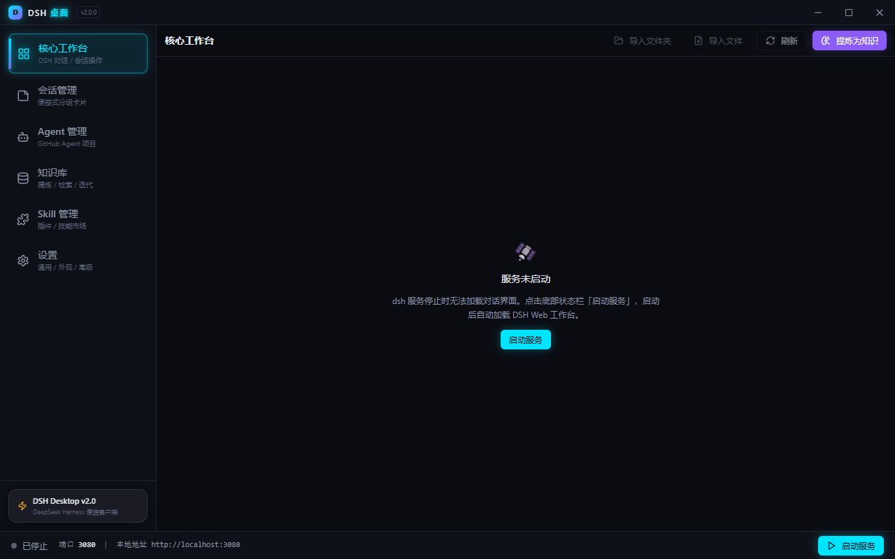
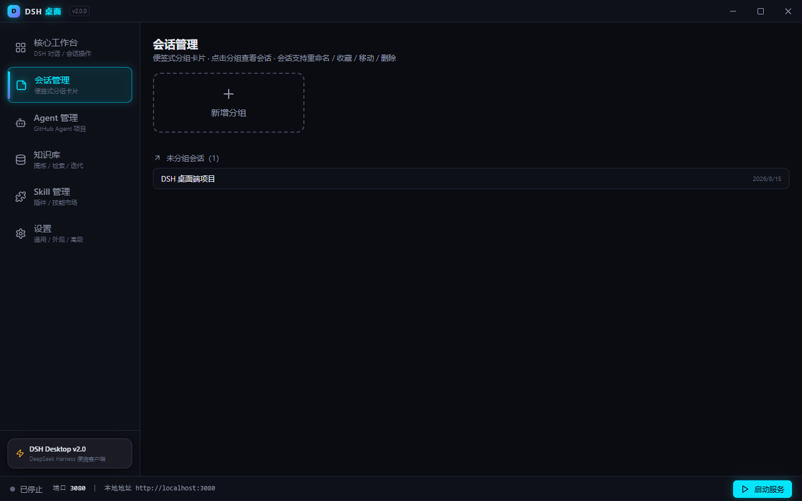
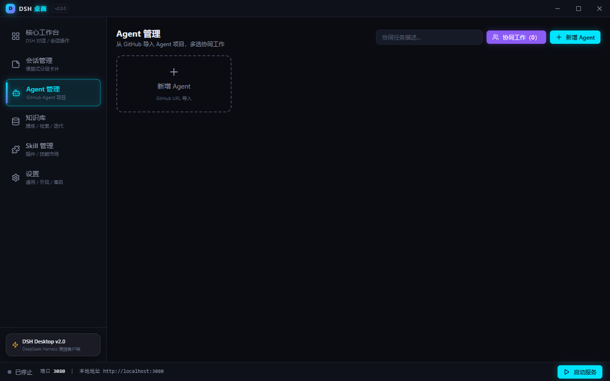
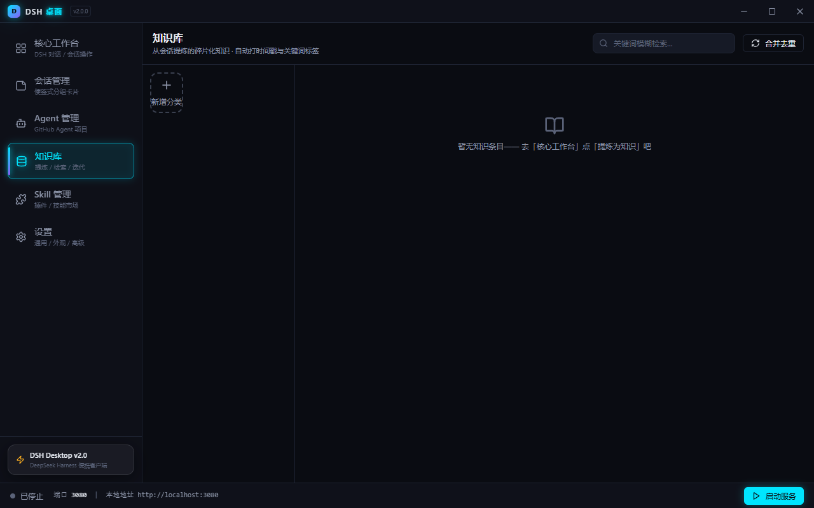
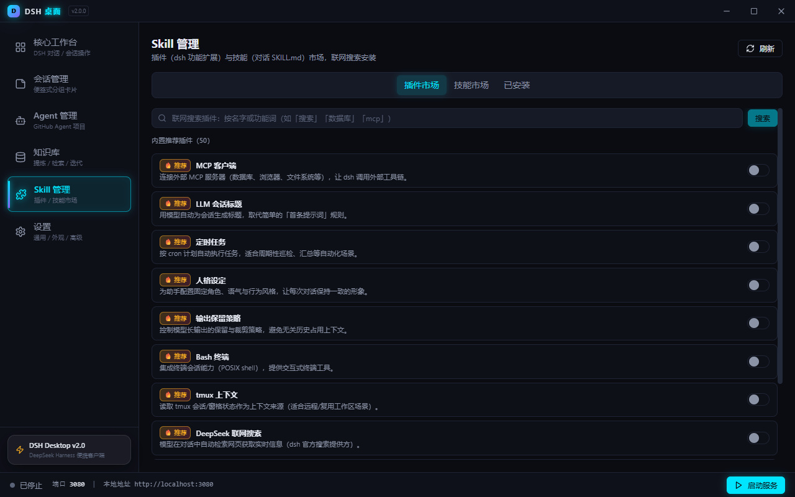
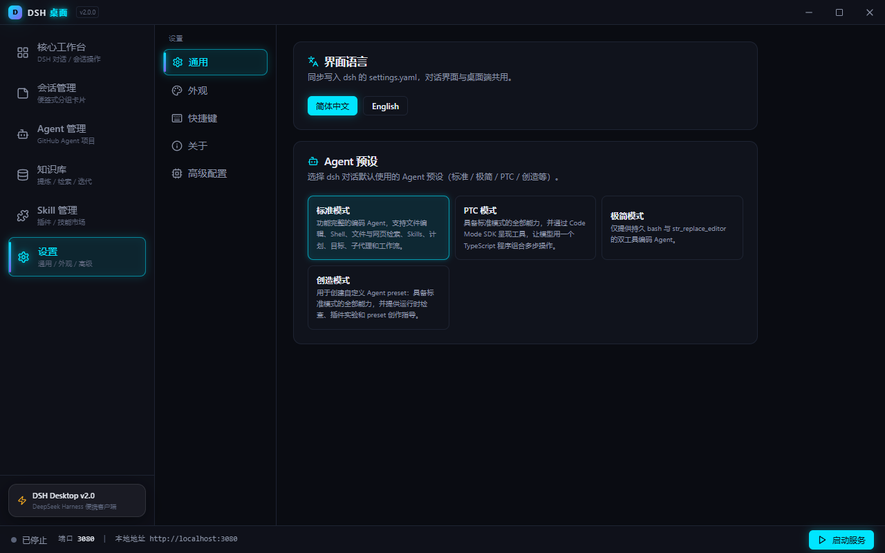
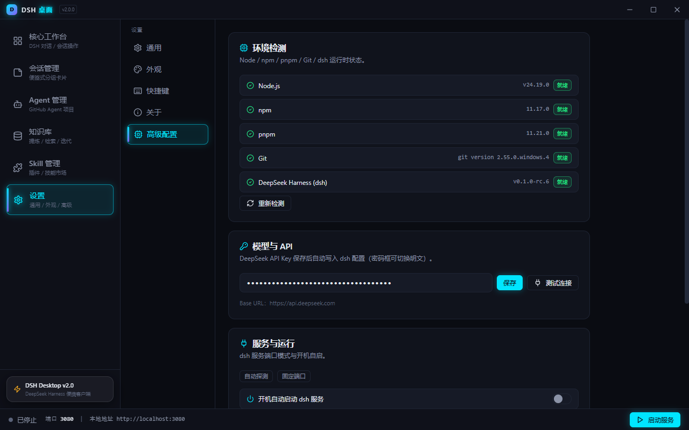

<div align="center">

# 🚀 DSH 桌面 v2.2.2

**把 DeepSeek Harness（DSH 完整服务）装进一个桌面窗口 —— 客户端是入口壳，DSH 原生功能一个不少**

> DeepSeek Harness（`@deepseek-ai/dsh`）的 Windows 桌面客户端
> React + 赛博朋克 UI · 全中文界面 · 内嵌 DSH Web 完整服务（模型 / 会话 / API Key 原生管理）

[](https://github.com/gyg9006/DSH-Desktop/releases)
[]()
[]()
[]()
[]()
[](./LICENSE)

## 📥 立即下载

**👉 [GitHub Releases 下载 v2.2.2](https://github.com/gyg9006/DSH-Desktop/releases)**

- 下载 `DSH-Desktop-v2.2.2-win.zip`，解压后双击 `DSH-Desktop.exe` 即可使用；
- 内置便携 Node / npm / pnpm / Git / dsh 运行环境，**电脑上什么都不用装**；
- 首次启动两步引导（工作文件夹 → 环境检测），核心工作台内嵌 DSH 完整服务，**不自动打开外部浏览器**；
- 支持应用内**非阻断更新**（24 小时缓存、语义化版本比较、仅启动时检查一次，Toast 提示不弹窗阻断）。

</div>

---

## ✨ v2.1.0 体验优化专项（6 项）

1. **首次启动三步引导**：工作文件夹 → 环境检测/一键安装 → API Key 配置并测试；修复首次白屏，完成引导自动拉起服务；
2. **上传下载智能同步**：A/B 电脑按「文件修改时间 vs 远端提交时间」比对（谁新谁赢），预览面板（上传/下载/跳过/冲突 + 勾选）、冲突三选一（保留本地/使用远程）、同步模式/时间容差/排除规则/自动同步；
3. **环境一键安装 + 打包内置便携环境**：缺失项旁一键安装；Node/Git/pnpm/dsh 便携环境**打包进应用**（离线优先、sha256 版本锁定），未内置自动回退网络；
4. **版本更新提示与下载加速**：右下角非阻断通知（[立即更新][稍后提醒][查看日志]）+ 进度窗口；下载升级为 **4 线程分片 + 断点续传 + 镜像测速 + SHA256 校验**（发布侧随包上传 SHA256SUMS）；
5. **工作文件夹设置与数据迁移**：设置 → 通用 → 工作文件夹（当前路径 + 更改位置并迁移）；原子迁移（流式复制 → 完整性校验 → 切换 → 旧目录备份 → 失败回滚）；
6. **会话背景自定义**：设置 → 外观 → 会话背景（跟随主题 / 纯色 / 8 组渐变 / 上传图片自动压缩 ≤2K）+ 填充/透明度/模糊调整，仅作用于对话区域。

---

## 🛡️ v2.1.2 ~ v2.1.5 加固与修复

1. **便携环境真正内置（三级解析）**：内置环境为**解压目录形态**（`resources/portable-env/node|git|pnpm|dsh-cli/`）随包分发；新增 `env-resolver` 三级优先级（**内置 → 工作区 → 系统**），环境检测显示 [内置]/[工作区]/[系统] 来源标签；缺失项一键安装自动启用内置环境（[启用内置环境] 按钮），npm/pnpm/dsh 安装前自动确保便携 Node；
2. **EXE 命名 ASCII 化**：`productName`/`executableName` 改为 `DSH-Desktop`（修复中文名导致 exe 文件名乱码）；构建后自动校验（`verify-build.mjs`：exe 名正则 + 内置环境完整性 + VC 运行库 + feature-registry）；
3. **首次引导可跳过**：三步引导每步底部「跳过引导」，确认后直接进入主界面（环境与 Key 可稍后配置）；
4. **Win10 LTSC 精简系统兼容**：内置 VC++ 运行库 DLL（vcruntime140 等）随包分发，node.exe 免系统安装即可运行；
5. **API Key 保存即同步**：保存 Key 自动启用厂商 + 补齐默认模型 → 实时同步 dsh 模型选择器与凭据，不再反复弹「输入 API Key」；
6. **设置 → 高级 → 日志卡片**：查看应用/dsh 服务日志、一键导出 zip、清空，排查问题直接附上；
7. **服务端口配置 hover 提示**：自动探测 / 固定端口悬停说明；
8. **版本更新保护机制**：`feature-registry.json` 功能注册表 + 更新包安装前冒烟测试（失败中止更新）+ 替换后二次校验失败自动回滚 + `logs/update-report.md` 更新留档。

---

## 📸 先看一眼

| 主界面（内嵌 dsh 对话） | 会话管理（便签卡片） |
|:---:|:---:|
|  |  |
| **Agent 管理（GitHub 导入）** | **知识库（提炼 / 检索 / 迭代）** |
|  |  |
| **Skill 管理（插件 / 技能市场）** | **设置（子菜单布局）** |
|  |  |
| **高级配置（环境 / 备份 / 同步 / 一键更新）** | |
|  | |

---

## ✨ 为什么值得下载

### 🟢 一个文件夹 = 你的整个工作台
- **绿色免安装**：Node / npm / pnpm / Git / dsh 全部内置，双击即用，不写注册表、不污染 `%APPDATA%`；
- **拷贝即迁移**：整个文件夹拷到任意 Win10/Win11 电脑继续用 —— 对话、技能、插件、模型配置原样带过去；
- **dsh 版本升级无忧**：客户端动态解析 dsh 启动入口、通用配置同步，dsh 升级后照常使用。

### 🛰️ 赛博朋克工作台 + 全局换肤
- 自定义无边框标题栏、霓虹流光导航栏、玻璃拟态面板、Canvas 粒子欢迎页、底部状态栏（端口 / 地址 / 状态灯 / 一键启停）；
- **主题插件全局化**：主题插件（tokens.json + theme.css）作用于**整个客户端**——标题栏、侧边栏、工作台、弹窗、设置、托盘图标全部跟随；内置示例主题「霓虹粉」，切换即时生效。

### 🌐 模型 / 会话 / API Key —— DSH 原生管理
- 核心工作台内嵌 **DSH 完整服务 Web 界面**，模型选择器、会话管理、API Key 配置全部由 DSH 原生渲染与存储；
- 客户端**不再重复实现**模型/API 模块（v2.2 架构还原），避免两套配置不同步；
- API Key 加密存储于 DSH 工作目录，界面掩码显示，明文不落盘；
- DSH 启动强制 `--no-open` 且 webview 拦截新窗口，服务只在客户端内显示。

### 💬 开箱即聊
- 首次启动两步引导（工作文件夹 → 环境检测）后自动拉起 DSH 服务，直接对话；
- 模型与 API Key 统一在 DSH 原生界面配置，保存即生效。

### 🧩 六大功能模块
1. **核心工作台**：内嵌 DSH 完整服务（对话 / 模型选择 / API 配置 / 会话）+ 导入导出 + **「提炼会话」一键智能提炼**（六步 Skill 流水线：蒸馏 → 代码萃取 → 向量化 → 去重合并 → 归档 → 反馈）；
2. **知识库**：从会话提炼碎片化知识（自动时间戳 + 关键词标签），关键词检索、合并去重迭代；
3. **Agent 管理**：GitHub URL 导入 Agent 项目，运行与多 Agent 协同；
4. **Skill 管理**：插件 / 技能双市场，联网搜索安装、🔥 前 10 推荐、已安装双列管理；
5. **设置**：通用（工作文件夹 / 语言 / Agent 预设）、外观（主题 / 明暗）、快捷键、关于、高级配置（环境 / 服务 / 备份 / 同步 / 日志）、**全局行为规则**（永久指令可视化编辑）；
6. **异地智能同步**：A/B 电脑 Git 时间戳智能比对同步（技能 / 插件 / 知识 / 会话，凭据除外）。

### 🛟 数据安全与运维
- 一键备份 / 自动备份（每天每周 + 滚动保留）/ 恢复 / 出厂重置；
- A/B 电脑 Git 异地同步（技能 / 插件 / 知识 / 会话全量镜像，凭据除外）；
- 环境检测**一键更新** Node / Git / pnpm / dsh；应用内自动 / 手动更新。

---

## 🧩 功能总览

| 模块 | 能力 |
|---|---|
| **核心工作台** | 内嵌 DSH 完整服务 Web（对话 / 模型选择 / API 配置 / 会话原生管理）+ 会话导入导出 + 一键智能提炼流水线（六步 Skill 编排 + 进度条） |
| **知识库** | 分类网格、条目 CRUD、关键词/分类检索、提炼入库、合并去重迭代 |
| **Agent 管理** | GitHub 项目导入、卡片状态、运行日志、多选协同工作 |
| **Skill 管理** | 插件/技能市场（联网搜索 + 分页 + 推荐标记）、已安装双列管理 |
| **设置** | 通用（工作文件夹 / 语言 / Agent 预设）/外观/快捷键/关于/高级配置/全局行为 |
| **高级配置** | 环境检测（**一键安装/启用内置环境** + 一键更新）、服务端口（自动探测/固定 + hover 提示）、开机自启、自动备份、**智能同步**（预览/冲突三选一/自动同步）、**日志**（查看/导出/清空） |
| **全局行为** | 永久指令（问题解决优先级协议）落盘 global-rules.md，可视化编辑 |
| **更新** | 启动时检查一次 + 手动检查（24 小时缓存、语义化版本比较），Toast 非阻断提示 + 多线程下载 + 断点续传 + SHA256 校验 + 冒烟测试与失败回滚 |

**快捷键**：`Ctrl+B` 收起/展开侧边栏 · `Ctrl+N` 新建对话 · `Ctrl+,` 打开设置

---

## 🚀 快速上手

### 方式一：直接下载绿色版（推荐）

```
DSH-Desktop/
├── app/                  ← 程序本体（app\DSH-Desktop.exe）
├── workspace/            ← 工作文件夹（运行环境 + 全部数据，随文件夹拷走）
│   ├── runtime/          ← 内置 Node / npm / pnpm / Git / dsh
│   ├── data/             ← DSH 数据目录（对话、设置、凭据，由 DSH 原生管理）
│   ├── skills/           ← 技能
│   ├── themes/           ← 主题插件
│   ├── backups/          ← 备份
│   └── logs/             ← 日志（含 update-report.md 更新留档）
└── DSH-Desktop.exe       ← 双击启动
```

1. 解压后双击 `DSH-Desktop.exe`；
2. 首次启动两步引导（工作文件夹 → 环境检测），进入核心工作台自动拉起 DSH 服务（端口被占自动顺延）；
3. 在 DSH 完整服务界面内配置 API Key 与模型（客户端不再重复实现）；
4. 在核心工作台直接对话，聊完点「提炼会话」沉淀到知识库。

> 💡 换机：整个文件夹拷过去即可，无需重新安装任何东西。

### 方式二：从源码构建

```bash
# 环境要求：Node.js ≥ 18（实测 v24 正常）
npm install
npm run dev          # 开发模式（热更新）
npm test             # 单元测试（255 项）
npm run prepare:env  # 下载并解压打包内置便携环境（Node/Git/pnpm/dsh 目录 + env-manifest.json）
npm run pack:dir     # 打包为绿色目录（构建 + verify-build 校验，输出到 ../DSH-Desktop/app）
node scripts/release.mjs   # 生成更新包 zip + SHA256SUMS
```

> 推送 `vX.Y.Z` tag 即触发 GitHub Actions 自动构建发布（typecheck + 单测 + 打包 + 生成更新包 + 创建 Release 上传资产）。

---

## 🧭 技术栈

| 层 | 技术 |
|---|---|
| 桌面框架 | Electron 43（无边框窗口）+ electron-vite 5 + electron-builder 26 |
| 前端 | **React 19** + TypeScript 5.9 + Tailwind CSS（Design Token 主题变量）+ shadcn 风格组件（Radix primitives） |
| 状态/数据 | hooks + IPC 白名单桥（contextBridge，全类型定义） |
| 安全 | DSH 凭据由 DSH 原生 safeStorage 加密管理；渲染层不接触明文 |
| 测试 | Vitest（主进程纯逻辑 + 共享层 + 真实内置环境 e2e） |
| 运行时 | 内置 Node / npm / pnpm / Git / dsh（`@deepseek-ai/dsh`），DSH 服务由客户端内嵌 webview 承载 |

```
src/
├── main/       主进程：dsh 服务生命周期 / 知识库 / Agent / 插件 / 技能市场 /
│               主题 / 备份 / 同步 / 更新 / 迁移 / 窗口 / 托盘 / IPC / 全局规则 /
│               环境检测与一键安装 / env 安装状态与 PATH 注入
├── preload/    安全白名单 API（contextBridge）
├── renderer/   React 19 界面
│   └── src/
│       ├── components/layout/   TitleBar / Sidebar / Footer
│       ├── components/views/    核心工作台（内嵌 DSH webview）+ 知识库 / Agent / Skill / 设置
│       ├── components/ui/       shadcn 风格组件（button/card/dialog/tabs/…）
│       ├── hooks/               useDshService / useTheme
│       └── lib/                 主题注入 / cn / appInfo
└── shared/     主进程与渲染层共享的类型与纯逻辑
```

---

## ❓ 常见问题

**SmartScreen 提示「已保护你的电脑」？**
未签名应用的正常提示：点「更多信息 → 仍要运行」即可。程序不联网上传任何数据。

**杀毒软件误报？**
便携应用偶发误报，将整个文件夹加入白名单即可。

**端口被占用？**
dsh 默认 3080，应用自动探测并在占用时**自动顺延**；也可在「设置 → 高级配置 → 服务与运行」固定端口。

**Win10 LTSC / 精简系统无法启动服务？**
v2.1.5 起内置 Node 已随包携带 VC++ 运行库 DLL（vcruntime140 等），无需系统安装；若仍异常，到「设置 → 高级配置 → 日志」导出日志排查，或查看 `工作文件夹\logs\dsh.log`。

**模型选择器里没有模型？**
在核心工作台的 DSH 完整服务界面内配置 API Key 与模型（客户端不重复实现）；DSH 原生管理模型列表与选择器，配置保存即生效。

**更新失败会损坏当前版本吗？**
不会。更新包安装前会执行冒烟测试（exe/内置环境/asar 完整性），失败自动中止；替换后二次校验，失败自动回滚到旧版本，`logs/update-report.md` 留档。

**如何安装主题插件？**
将主题插件目录（含 `theme-plugin.json` / `tokens.json` / `theme.css`）放入工作文件夹 `themes/` 下，重启后在「设置 → 外观」选择。

**dsh 升级后客户端异常？**
客户端动态解析 dsh 启动入口、配置同步采用 dsh 标准结构且不覆盖已有配置；升级后如仍异常，在「高级配置 → 环境检测」一键更新 dsh 即可。

---

## 🗺️ 里程碑

| 版本 | 内容 |
|---|---|
| v0.1~0.3 | 12 节规格落地：环境检测、会话管理、插件/技能市场、备份同步、自动更新（Vue 版） |
| **v2.0** | **React 19 + 赛博朋克 UI 全面重构**：六大模块、一键智能提炼流水线、主题插件全局化、全局行为规则、Agent 管理、知识库、Skill 管理 |
| **v2.1** | **体验优化专项**：首启三步引导 + 白屏修复、Git 时间戳智能同步、环境一键安装 + 内置便携环境、更新通知 + 多线程下载加速（SHA256 校验）、工作文件夹原子迁移、会话背景自定义 |
| **v2.1.2~v2.1.9** | **加固与修复**：便携环境解压目录形态 + 三级解析、EXE 命名 ASCII 化 + 构建校验、引导可跳过、VC++ 运行库内置（LTSC 兼容）、API Key 保存即同步、日志卡片、端口 Tooltip、版本更新保护机制（feature-registry + 冒烟 + 回滚）、单实例锁残留修复、个性化配置快照保护 |
| **v2.2** | **架构还原**：移除客户端重复的模型/API Key/会话实现，核心工作台内嵌 DSH 完整服务；引导精简为两步；设置移除「模型与 API」；服务健康检查、15 秒加载超时、崩溃恢复 |
| **v2.2.1~v2.2.2** | **环境与更新修复**：更新检查改为 24 小时缓存、启动一次 + 手动检查、语义化版本比较、非阻断 Toast；工作区 env 安装状态与 PATH 注入框架；**DSH 强制 `--no-open` + webview 新窗口拦截，禁止自动打开外部浏览器** |

---

## 📄 许可证

[MIT](./LICENSE) © 2026 DSH 桌面

本应用与 [DeepSeek Harness](https://www.npmjs.com/package/@deepseek-ai/dsh)（MIT）均为开源项目，可自由使用、修改与分发。
