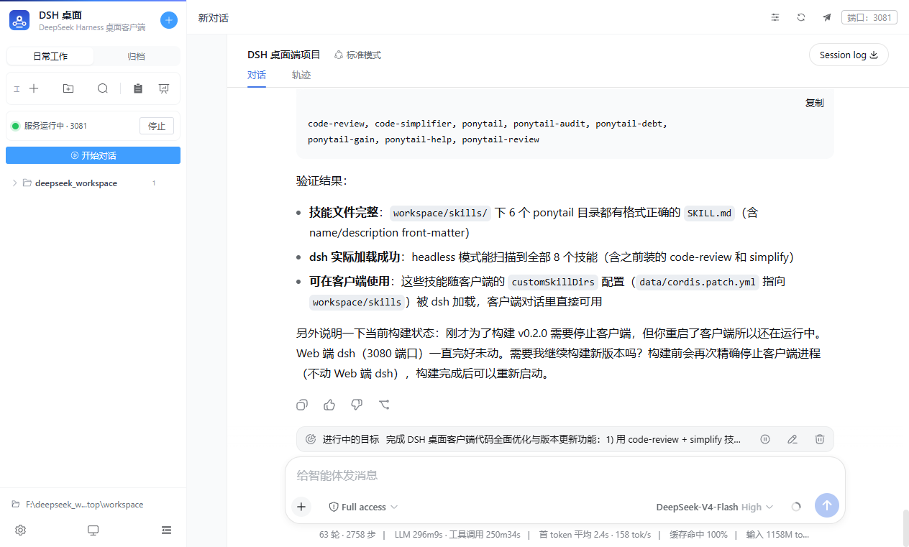
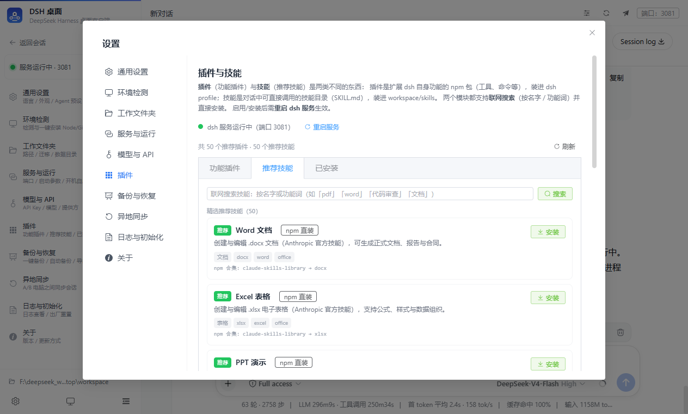
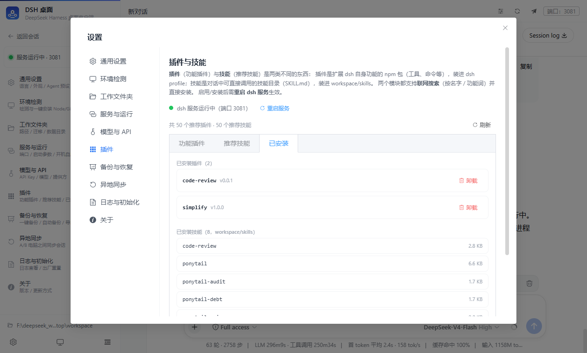
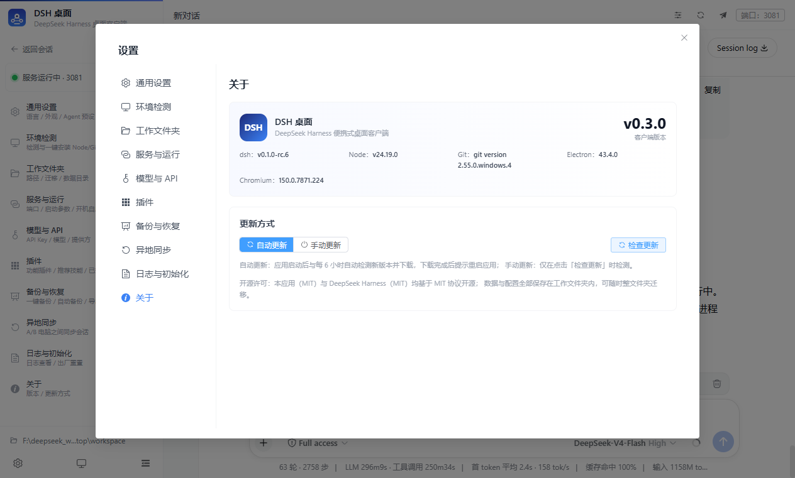
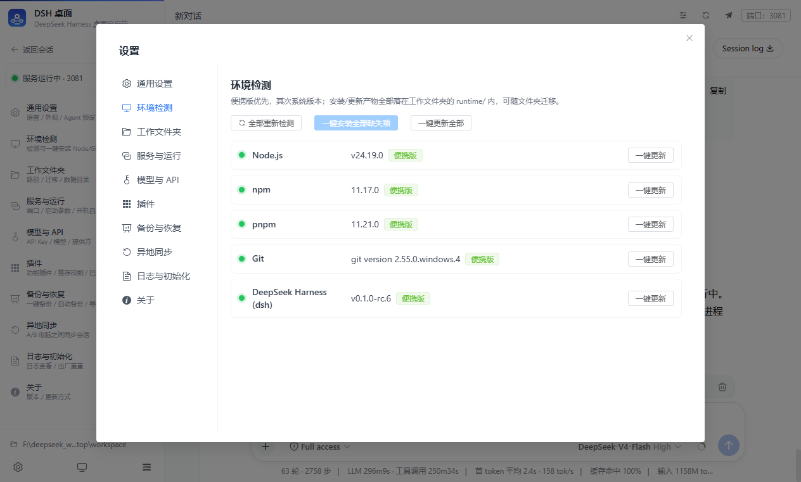
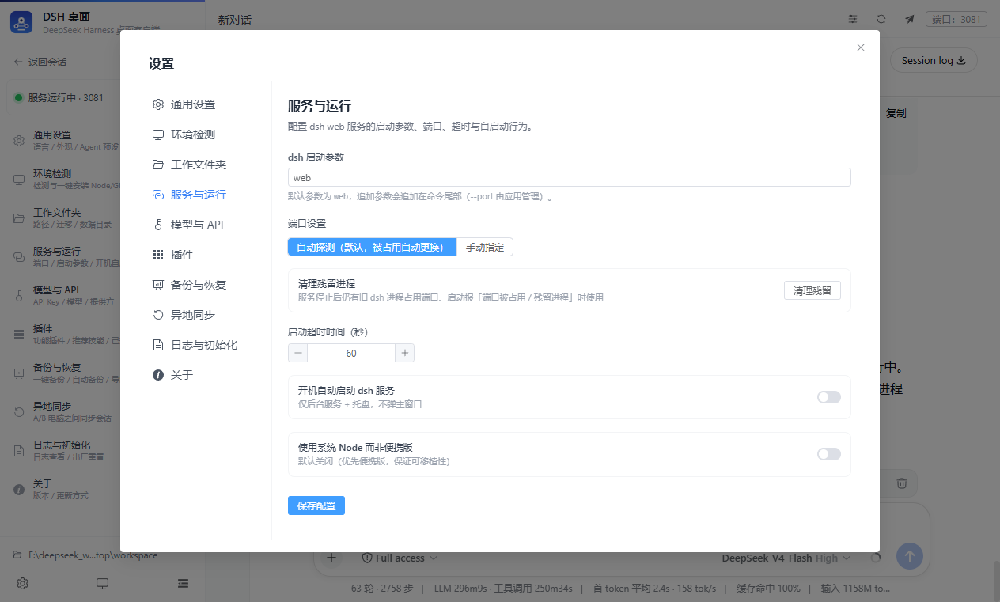
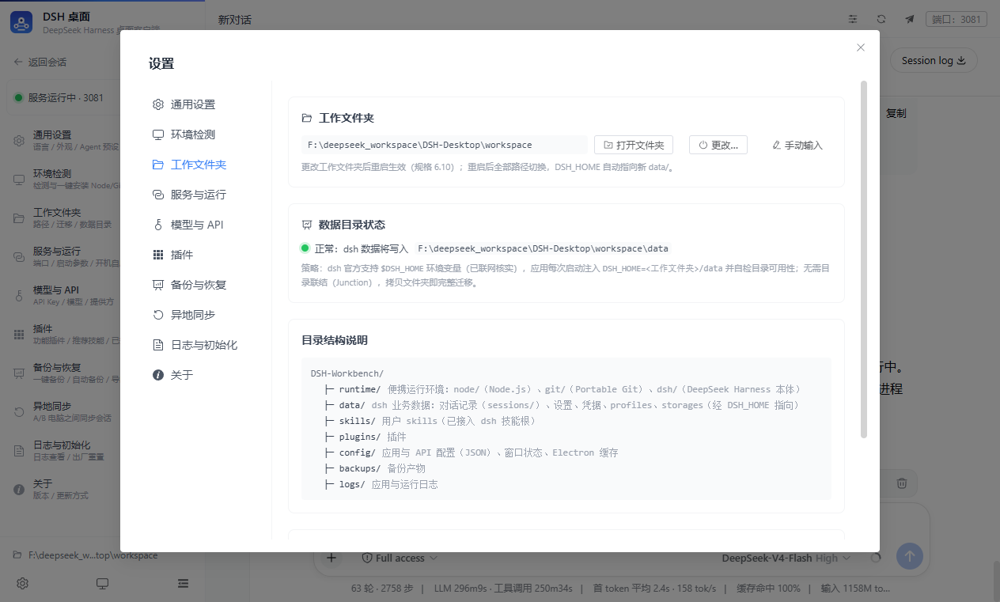
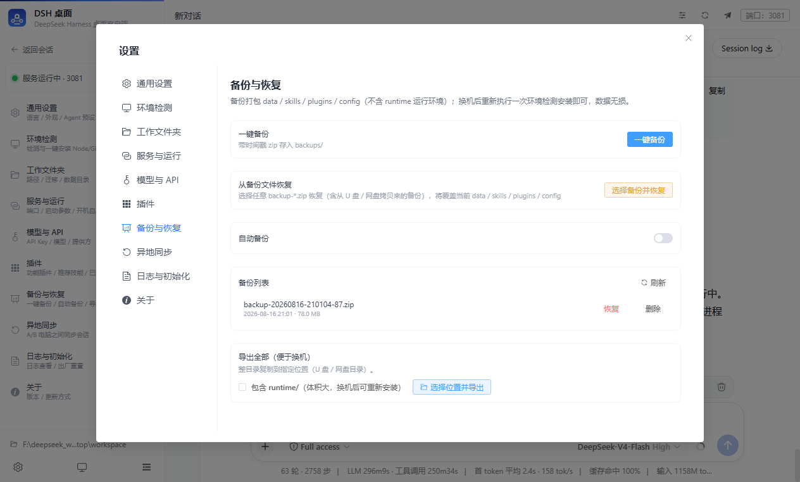
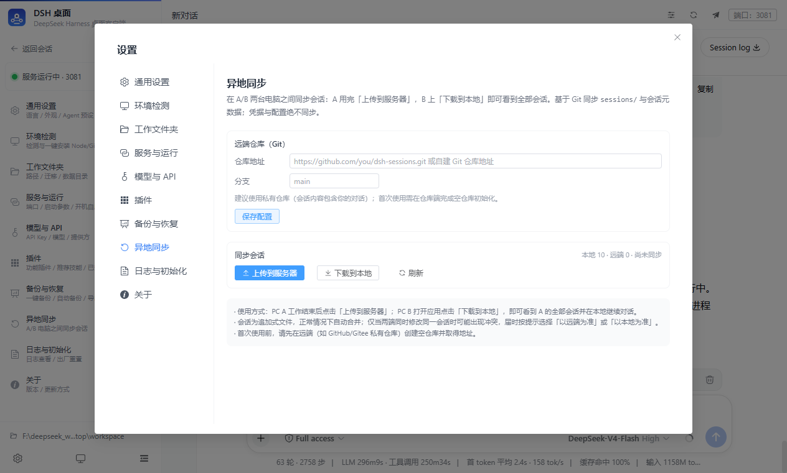

<div align="center">

# 🚀 DSH 桌面

**把 DeepSeek Harness 装进一个文件夹 —— 双击即用 · 拷贝即迁移 · 零安装、零残留**

> DeepSeek Harness（`@deepseek-ai/dsh`）的便携式 Windows 桌面客户端，
> 全中文界面，无需一行命令，打开就能聊。

[](https://github.com/gyg9006/DSH-Desktop/releases)
[]()
[]()
[]()
[]()
[]()
[](./LICENSE)

## 📥 立即下载

**👉 [GitHub Releases 下载 v0.3.0（绿色便携版）](https://github.com/gyg9006/DSH-Desktop/releases)**

- 下载 `DSH-Desktop-v0.3.0-win.zip`，解压后双击「启动 DSH 桌面.bat」即可开始使用；
- 内置便携 Node / Git / dsh 运行环境，**电脑上什么都不用装**；
- 支持应用内**自动更新**（每 6 小时检测 GitHub Releases 新版本，一键升级）。

</div>

---

## 📸 先看一眼

| 主界面（侧边栏 + 内嵌 dsh 对话） | 插件与技能（联网搜索） |
|:---:|:---:|
|  |  |
| **已安装（插件 + 技能一目了然）** | **关于（版本与更新）** |
|  |  |
| **环境检测（一键安装缺失项）** | **服务与运行（端口 / 自启 / 托盘）** |
|  |  |
| **工作文件夹（拷贝即迁移）** | **备份与恢复（自动备份）** |
|  |  |
| **异地同步（A/B 电脑）** | |
|  | |

---

## ✨ 为什么值得下载

### 🟢 一个文件夹 = 你的整个工作台
- **绿色免安装**：Node / Git / dsh 全部内置在文件夹里，双击即用，不需要命令行、不需要管理员权限、不写注册表、不污染 `%APPDATA%`；
- **拷贝即迁移**：把整个文件夹拷到 U 盘 / 网盘 / 局域网，换任何一台 Win10/Win11 电脑继续用 —— 对话记录、技能、插件、API 配置原样带过去，dsh 自动修复内部依赖，数据零丢失。

### 💬 开箱即聊，真实 dsh
- 一键启动真实 DeepSeek Harness 服务（端口自动探测、被占用自动顺延），内嵌官方 Web 界面直接对话；
- 模型与 API：填入 DeepSeek API Key 即自动写入 dsh 配置并热重载，无需重复配置。

### 🧩 插件与技能，联网一键安装
- **功能插件**：内置推荐插件一键启用/停用，还支持按名字或功能词**联网搜索** npm 插件直接安装；
- **推荐技能**：50 个精选开源技能（含 Anthropic 官方技能、obra/superpowers 等），并支持**联网搜索**任意 npm 技能包，装进 `workspace/skills` 立即在对话中使用。

### 🗂 强大的会话管理
- 会话**重命名 / 分叉 / 归档 / 收藏 / 分组 / 批量删除**，归档按年月日归档可搜索还原；
- **导入会话**：文件夹 / 单个会话 / zip / tar 压缩包，导入自动解压、自动修复编码；
- **异地同步**：A/B 两台电脑基于 Git 同步全部会话。

### 🛟 数据安全
- 一键备份（每日 / 每周自动滚动）、恢复、出厂重置；
- 一键迁移本机已有的 dsh 存量数据（对话 / 技能 / 设置 / 凭据）；
- 应用内自动 / 手动更新，更新包走 GitHub Releases。

---

## 🧩 功能总览

| 模块 | 能力 |
|---|---|
| **环境检测** | Node / npm / pnpm / Git / dsh 五项检测，缺失项一键安装到工作文件夹 |
| **服务与运行** | 一键启停、端口自动顺延、启动超时配置、开机自启、系统托盘常驻 |
| **模型与 API** | API Key 管理（密码框）、自定义 Base URL、模型发现、测试连接，自动同步 dsh |
| **会话管理** | 分组 / 归档 / 收藏 / 重命名 / 分叉 / 移动 / 批量删除 / 导入导出 |
| **插件** | 内置推荐插件 + 联网搜索 npm 插件（按名字/功能词）一键安装卸载 |
| **技能** | 50 个精选技能 + 联网搜索 npm 技能包，一键安装到 workspace/skills |
| **备份恢复** | 一键备份 / 自动备份（每天每周 + 滚动保留）/ 导出 zip / 恢复 |
| **异地同步** | 基于 Git 的 A/B 电脑会话同步（上传 / 下载 / 对齐删除） |
| **通用设置** | 语言（中/英）、深色/浅色/跟随系统、Agent 预设，热同步 dsh |
| **日志与初始化** | 应用 / dsh 日志查看、过滤、导出、清空；出厂重置 |
| **关于与更新** | 客户端 / dsh / Node / Git 版本一目了然，自动或手动更新 |

**快捷键**：`Ctrl+B` 收起/展开侧边栏 · `Ctrl+N` 新建对话 · `Ctrl+,` 打开设置

---

## 🚀 快速上手

### 方式一：直接下载绿色版（推荐）

```
DSH-Desktop/
├── app/                  ← 程序本体（app\DSH 桌面.exe）
├── workspace/            ← 工作文件夹（运行环境 + 全部数据，随文件夹拷走）
│   ├── runtime/          ← 便携 Node / Git / dsh
│   ├── data/             ← 对话记录、设置、凭据、profiles
│   ├── skills/           ← 技能
│   ├── backups/          ← 备份
│   └── logs/             ← 日志
└── 启动 DSH 桌面.bat     ← 双击启动
```

1. 解压后双击「启动 DSH 桌面.bat」；
2. 首次启动三步向导：确认工作文件夹 → 环境检测（已内置，无需安装）→ 完成；
3. 「设置 → 模型与 API」填入 DeepSeek API Key → 保存 → 测试连接；
4. 点「开始对话」，服务自动拉起，开始使用。

> 💡 换机：整个文件夹拷过去即可，无需重新安装任何东西。

### 方式二：从源码构建

```bash
# 环境要求：Node.js ≥ 18（实测 v24 正常）
npm install
npm run dev          # 开发模式（热更新）
npm test             # 单元测试（181 项）
npm run pack:dir     # 打包为绿色目录（输出到 ../DSH-Desktop/app）
```

---

## 🧭 技术栈

| 层 | 技术 |
|---|---|
| 桌面框架 | Electron 43 + electron-vite 5 + electron-builder 26 |
| 前端 | Vue 3.5 + Pinia + Element Plus + Tailwind CSS（深色模式） |
| 语言 | TypeScript 5.9（主进程 / preload / 渲染层全类型） |
| 测试 | Vitest（181 项单测，主进程纯逻辑 + 共享层） |
| 运行时 | 便携 Node / Git / dsh（`@deepseek-ai/dsh`） |

```
src/
├── main/       主进程：配置 / 环境检测 / 安装器 / 迁移 / dsh 服务 / 会话 /
│               API / 插件 / 技能市场 / 备份 / 同步 / 托盘 / 更新 / IPC
├── preload/    安全白名单 API（contextBridge）
├── renderer/   Vue3 界面（侧边栏 / 对话 webview / 设置 10 Tab / 向导）
└── shared/     主进程与渲染层共享的纯逻辑与类型（可单测）
```

> 关键技术：通过 `$DSH_HOME` 环境变量把全部 dsh 数据收敛到工作文件夹（`DSH_TELEMETRY_DISABLED=1` 关闭遥测）；Electron userData/sessionData/logs 在 ready 前重定向，实测零系统残留。

---

## ❓ 常见问题

**SmartScreen 提示「已保护你的电脑」？**
未签名应用的正常提示：点「更多信息 → 仍要运行」即可。程序不联网上传任何数据。

**杀毒软件误报？**
便携应用偶发误报，将整个文件夹加入白名单即可；如需彻底消除可用代码签名证书签名。

**端口被占用？**
dsh 默认 3080，应用自动探测并在占用时顺延到下一可用端口；也可在「设置 → 服务与运行」手动固定。

**换机后 dsh 提示异常？**
首次启动会自动重建内部依赖链接（自愈）；若仍未生效，删除 `$DSH_HOME/profiles/node_modules` 后重启服务。

**备份恢复后需要做什么？**
备份不含运行环境（体积大且机器相关），换机恢复后重新执行一次「环境检测 → 一键安装缺失项」即可，数据无损。

---

## 🗺️ 里程碑

| 里程碑 | 内容 | 状态 |
|---|---|---|
| M1~M7 | 12 节规格全部落地：环境检测、一键安装、迁移、服务生命周期、会话管理、打包便携验证、错误处理加固 | ✅ |
| R2~R9 | 迭代增强：会话组织（分组/归档/收藏/批量）、导入会话、异地同步、插件与技能市场、API 双向同步、视图分组排序、中文路径加固 | ✅ |
| v0.2.0 | 应用内版本更新（自动/手动）、YAML 往返修复、关闭窗口修复、服务超时修复 | ✅ |
| v0.3.0 | 插件/技能**联网搜索**（按名字/功能词）、设置拆分（日志与初始化 / 关于）、已安装双列表 | ✅ |

---

## 📄 许可证

[MIT](./LICENSE) © 2026 DSH 桌面

本应用与 [DeepSeek Harness](https://www.npmjs.com/package/@deepseek-ai/dsh)（MIT）均为开源项目，可自由使用、修改与分发。
